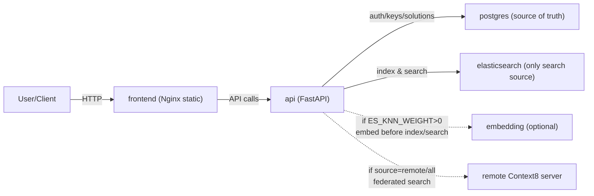

# Context8 Docker (Private + Team)

English | [简体中文](README.zh-CN.md)

All-in-one self-hosted deployment for teams: Dashboard + API + Elasticsearch + Postgres (optional Embedding).

This Docker edition is intentionally simple and predictable:
- Elasticsearch is the only search source (`/search` never falls back to the database).
- Writes are synchronous: the API writes Postgres, then indexes Elasticsearch in the same request path.
- Optional semantic search is enabled via ES kNN and an embedding service.
- Optional federated search can query a remote Context8 server using an API key.

## Architecture



Services in `docker-compose.yml`:
- `frontend`: prebuilt Nginx static image (admin dashboard).
- `api`: prebuilt FastAPI image + Alembic migrations; enforces auth, permissions, quotas, ES-only search, and federation.
- `postgres`: durable data store (users, API keys/subkeys, solutions, votes).
- `elasticsearch`: the only search backend.
- `embedding` (profile `semantic`): prebuilt sentence-transformers image used for kNN.

For local source builds during development, use `docker-compose.dev.yml` override.

## Quick Start

1. Create your `.env`:
   ```bash
   cp .env.example .env
   ```
2. Set required secrets in `.env`:
   - `POSTGRES_PASSWORD`
   - `JWT_SECRET`
   - `API_KEY_SECRET`
   - `VITE_API_BASE` (the browser-reachable API base, e.g. `http://localhost:8000`)

   Tip:
   ```bash
   openssl rand -hex 32
   ```
3. Start:
   ```bash
   docker compose up -d --pull always
   ```

Agent-ready setup (interactive):
```bash
./scripts/configure_context8_docker.sh --up --smoke
```

When `--up` is used, the configurator auto-installs `context8-mcp` if `npm` exists.
If `API_KEY` is exported, it also auto-runs `context8-mcp remote-config` to local Docker API `http://localhost:${API_PORT:-8000}`.
Use `--install-mcp` to make it strict (fail when `npm` is missing), or `--skip-install-mcp` to disable it.

Agent-ready setup (non-interactive):
```bash
./scripts/configure_context8_docker.sh \
  --non-interactive \
  --api-base "http://localhost:8000" \
  --enable-semantic false \
  --enable-federation false \
  --up \
  --smoke
```

Open:
- Dashboard: `http://<host>:3000`
- API docs: `http://<host>:8000/docs`

First-time setup:
- Open the Dashboard and create the admin account (one-time).
- Login as admin and mint API keys for your team/services.

## Agent Deployment Entry

Public skill entry for Vibe Coding agents / OpenClaw:
- [SKILL.md](SKILL.md)

Raw URL (for `curl`/automation):
- `https://raw.githubusercontent.com/context8/context8-docker/main/SKILL.md`

Terminal configurator interface:
```bash
./scripts/configure_context8_docker.sh --help
```

## Update (npm-like)

Default one-command update:
```bash
./scripts/update_context8_docker.sh
```

This command runs:
1. `docker compose pull`
2. `docker compose up -d --force-recreate --remove-orphans`
3. health check (`GET /status/summary`)
4. image digest/container summary output

Rollback to a fixed version:
```bash
CONTEXT8_VERSION=v1.2.2 ./scripts/update_context8_docker.sh
```

Switch registry channel:
```bash
CONTEXT8_REGISTRY=ghcr.io/context8 ./scripts/update_context8_docker.sh
# or
CONTEXT8_REGISTRY=docker.io/<org_or_user> ./scripts/update_context8_docker.sh
```

Optional one-shot Watchtower update (manual trigger only, not scheduled):
```bash
./scripts/update_context8_docker_once_watchtower.sh
```

Security note: Watchtower mounts `/var/run/docker.sock` and has high host control privilege.

Image channel env keys in `.env`:
- `CONTEXT8_VERSION` (default `v1`, stable major channel)
- `CONTEXT8_REGISTRY` (default `ghcr.io/context8`)
- optional exact image overrides: `CONTEXT8_API_IMAGE`, `CONTEXT8_FRONTEND_IMAGE`, `CONTEXT8_EMBEDDING_IMAGE`

## Release Images (Maintainers)

- Workflow: `.github/workflows/publish-images.yml`
- Trigger: push semver tag like `v1.2.3`
- Targets: GHCR + Docker Hub (api/frontend/embedding)
- Required GitHub secrets: `DOCKERHUB_USERNAME`, `DOCKERHUB_TOKEN`

Admin password recovery (no DB schema changes):
- Set `ADMIN_RESET_TOKEN` in `.env` (a long random string), then restart `api`.
- Use the reset endpoint:
  ```bash
  curl -fsS -X POST "$API_BASE/auth/admin/reset-password" \
    -H "Content-Type: application/json" \
    -H "X-Admin-Reset-Token: $ADMIN_RESET_TOKEN" \
    -d '{"identifier":"admin","newPassword":"<new-strong-password>"}'
  ```
  where `identifier` can be `username` or `email`.
- Then log in again at `/auth/login`.

## Visibility Model

This Docker edition supports `private` and `team` (no `public`):
- `private`: only visible to the API key / user that owns it.
- `team`: visible to all authenticated users and API keys in the same deployment.

## Search Behavior (Important)

- `POST /search` always queries Elasticsearch (no DB/pgvector fallback).
- When `ES_KNN_WEIGHT > 0`, the API enables ES kNN and calls the embedding service to build vectors.
- When `ES_KNN_WEIGHT = 0`, search is pure BM25.

## Semantic Search (Optional)

1. Enable weights in `.env`:
   - `ES_KNN_WEIGHT=1`
   - optional: tune `ES_BM25_WEIGHT`
2. Start with the `semantic` profile:
   ```bash
   docker compose --profile semantic up -d --pull always
   ```

Notes:
- The API will ensure the ES index mapping contains the `embedding` field when kNN is enabled.
- If you previously created the index without kNN, enabling kNN later is supported (mapping is upgraded in place).

## Federated Search (Optional)

Use this Docker instance as a “federation gateway” to query another Context8 server.

Set in `.env`:
```env
REMOTE_CONTEXT8_BASE=https://your-context8.example.com
REMOTE_CONTEXT8_API_KEY=...
REMOTE_CONTEXT8_ALLOW_OVERRIDE=false
REMOTE_CONTEXT8_ALLOWED_HOSTS=api.context8.org,localhost
```

Then call `POST /search` with:
- `source=local` (default): local only
- `source=remote`: remote only
- `source=all`: local + remote (results are concatenated and trimmed to `limit`)

Security notes:
- Header override (`X-Remote-Base` / `X-Remote-Api-Key`) is disabled by default.
- If enabled, the remote host must match `REMOTE_CONTEXT8_ALLOWED_HOSTS`, otherwise the request is rejected.

## MCP Compatibility / List Contracts

Different clients expect different list shapes; this Docker edition keeps stable contracts:
- `GET /v2/solutions`: paginated `{items,total,limit,offset}` (recommended for new clients).
- `GET /solutions`: compatibility route (API key returns an array; JWT returns a paginated object).
- `GET /mcp/solutions`: always returns an array (for MCP and strict array clients).

## Dashboard Settings

The Dashboard includes a `Settings` tab that:
- shows live `/status` + a sanitized config view (no secrets)
- generates copyable `.env` snippets for semantic search, federation, and CORS

It does not mutate the running container env. Apply changes by editing `.env` and rebuilding/restarting.

## Security Defaults

- Postgres and Elasticsearch are bound to `127.0.0.1` by default (`POSTGRES_BIND` / `ES_BIND`).
- CORS defaults to a safe localhost-only policy unless you set `CORS_ALLOW_ORIGINS` / regex explicitly.
- API container defaults to `nofile=65536` (`API_NOFILE_SOFT/HARD`).

If you expose Elasticsearch to the network, it has no auth by default (`xpack.security.enabled=false`).

## Health Checks

- `GET /status`: component status + version + uptime + sanitized config.
- `GET /status/summary`: a compact summary used by the dashboard and Docker health checks.

## Common Commands

```bash
# Logs
docker compose logs -f api

# Pull/update containers
./scripts/update_context8_docker.sh

# Local source build (development only)
docker compose -f docker-compose.yml -f docker-compose.dev.yml up -d --build

# Stop (keeps volumes)
docker compose down
```
