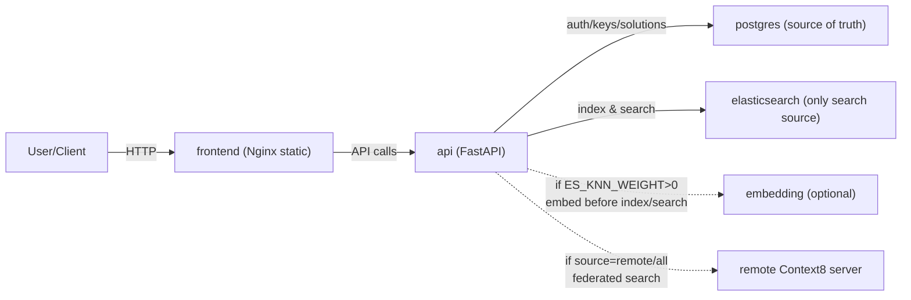

# Context8 Docker (Private + Team)

[English](README.md) | 简体中文

面向团队的内网一键部署：管理控制台 + API + Elasticsearch + Postgres（可选 Embedding）。

这个 Docker 版本刻意保持简单、可预测：
- Elasticsearch 是唯一检索源（`/search` 永不回退到数据库）。
- 写入是同步链路：API 先写 Postgres，再在同一次请求中写入 Elasticsearch。
- 可选语义检索：通过 ES kNN + embedding 服务启用。
- 可选联邦检索：使用 API key 查询远程 Context8（主系统或公网部署）。

## 架构



`docker-compose.yml` 里的服务：
- `frontend`：Vite 构建 + Nginx 静态站点（管理控制台）。
- `api`：FastAPI + Alembic；负责鉴权、权限/配额、ES-only 检索与联邦聚合。
- `postgres`：持久化业务数据（用户、API key/sub key、solutions、votes）。
- `elasticsearch`：唯一检索后端。
- `embedding`（`semantic` profile）：sentence-transformers 服务，用于 kNN 向量检索。

## 快速启动

1. 生成 `.env`：
   ```bash
   cp .env.example .env
   ```
2. 在 `.env` 里设置必填项：
   - `POSTGRES_PASSWORD`
   - `JWT_SECRET`
   - `API_KEY_SECRET`
   - `VITE_API_BASE`（浏览器可访问到的 API base，例如 `http://localhost:8000`）

   生成随机 secret：
   ```bash
   openssl rand -hex 32
   ```
3. 启动：
   ```bash
   docker compose up -d --build
   ```

面向 Agent 的一键配置（交互式）：
```bash
./scripts/configure_context8_docker.sh --up --smoke
```

当使用 `--up` 时，配置器会在检测到 `npm` 后自动安装 `context8-mcp`。
若已导出 `API_KEY`，还会自动执行 `context8-mcp remote-config` 指向本机 Docker API：`http://localhost:${API_PORT:-8000}`。
可用 `--install-mcp` 设为严格模式（缺少 `npm` 直接失败），或用 `--skip-install-mcp` 跳过自动安装。

面向 Agent 的一键配置（非交互）：
```bash
./scripts/configure_context8_docker.sh \
  --non-interactive \
  --api-base "http://localhost:8000" \
  --enable-semantic false \
  --enable-federation false \
  --up \
  --smoke
```

访问：
- 控制台：`http://<host>:3000`
- 后端文档：`http://<host>:8000/docs`

首次初始化：
- 打开控制台，按提示创建管理员账号（一次性）。
- 管理员登录后创建 API key，分发给团队或服务使用。

## Agent 部署入口

给 Vibe Coding Agent / OpenClaw 的公开技能入口：
- [SKILL.md](SKILL.md)

可直接 `curl` 的 raw 地址：
- `https://raw.githubusercontent.com/context8/context8-docker/main/SKILL.md`

终端配置器参数说明：
```bash
./scripts/configure_context8_docker.sh --help
```

管理员密码重置（不改数据库结构）：
- 在 `.env` 中设置 `ADMIN_RESET_TOKEN`（一串随机长字符串），重启 `api` 生效后执行：
  ```bash
  curl -fsS -X POST "$API_BASE/auth/admin/reset-password" \
    -H "Content-Type: application/json" \
    -H "X-Admin-Reset-Token: $ADMIN_RESET_TOKEN" \
    -d '{"identifier":"admin","newPassword":"<new-strong-password>"}'
  ```
  其中 `identifier` 支持管理员的 `username` 或 `email`。
- 重置后使用 `/auth/login` 重新登录。

## 可见性模型

此 Docker 版本只支持 `private` 与 `team`（无 `public`）：
- `private`：仅当前 API key / 用户可见。
- `team`：同一部署内所有已认证用户与 API key 可见。

## 检索规则（重要）

- `POST /search` 永远只查 Elasticsearch（无 DB/pgvector 回退）。
- 当 `ES_KNN_WEIGHT > 0`：开启 ES kNN，并调用 embedding 服务生成向量。
- 当 `ES_KNN_WEIGHT = 0`：只做 BM25 文本检索。

## 语义检索（可选）

1. 在 `.env` 启用权重：
   - `ES_KNN_WEIGHT=1`
   - 可选：调整 `ES_BM25_WEIGHT` 做混合
2. 用 `semantic` profile 启动：
   ```bash
   docker compose --profile semantic up -d --build
   ```

说明：
- API 会在启用 kNN 时确保 ES 索引 mapping 包含 `embedding` 字段。
- 如果索引之前是“无 kNN”创建的，后续启用 kNN 也支持（mapping 会原地升级）。

## 联邦检索（可选）

把本 Docker 部署当作“联邦入口”，查询另一个 Context8。

在 `.env` 配置：
```env
REMOTE_CONTEXT8_BASE=https://your-context8.example.com
REMOTE_CONTEXT8_API_KEY=...
REMOTE_CONTEXT8_ALLOW_OVERRIDE=false
REMOTE_CONTEXT8_ALLOWED_HOSTS=api.context8.org,localhost
```

调用 `POST /search` 时传：
- `source=local`（默认）：只查本地
- `source=remote`：只查远端
- `source=all`：本地 + 远端（结果拼接后按 `limit` 截断）

安全说明：
- 请求头覆盖（`X-Remote-Base` / `X-Remote-Api-Key`）默认禁用。
- 即使开启，远端 host 也必须命中 `REMOTE_CONTEXT8_ALLOWED_HOSTS` 白名单，否则请求会被拒绝。

## MCP 兼容 / 列表契约

不同客户端对列表返回形状的预期不同；此 Docker 版本保持稳定契约：
- `GET /v2/solutions`：分页 `{items,total,limit,offset}`（推荐新客户端使用）。
- `GET /solutions`：兼容路由（API key 返回数组；JWT 返回分页对象）。
- `GET /mcp/solutions`：固定返回数组（供 MCP 与严格 array 客户端使用）。

## 控制台 Settings

控制台包含 `Settings` 标签页：
- 展示实时 `/status` + 去敏配置视图（不返回任何 secret）
- 生成可复制的 `.env` 片段（语义检索 / 联邦 / CORS）

它不会直接修改运行中的容器环境。需要编辑 `.env` 后 rebuild/restart 才能生效。

## 安全默认值

- Postgres 与 Elasticsearch 默认只绑定 `127.0.0.1`（`POSTGRES_BIND` / `ES_BIND` 可调）。
- CORS 默认仅允许 localhost（除非显式配置 `CORS_ALLOW_ORIGINS` / 正则）。
- API 容器默认 `nofile=65536`（`API_NOFILE_SOFT/HARD` 可调）。

如果你把 Elasticsearch 暴露到公网，它默认无鉴权（`xpack.security.enabled=false`）。

## 健康检查

- `GET /status`：组件状态 + 版本 + uptime + 去敏配置。
- `GET /status/summary`：控制台与 Docker healthcheck 使用的摘要。

## 常用命令

```bash
# 看日志
docker compose logs -f api

# rebuild/restart
docker compose up -d --build

# 停止（保留 volumes）
docker compose down
```
